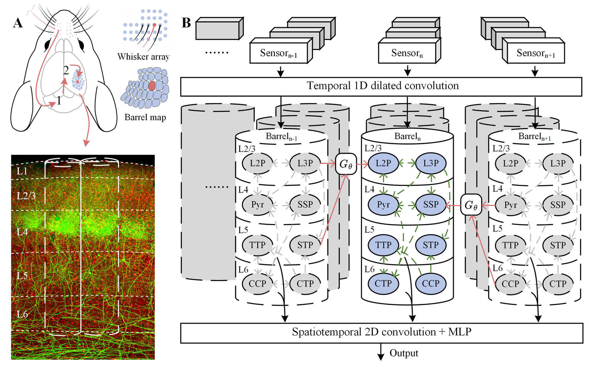

# MultiBarrelModel

Code implementation of our paper ['Localist Topographic Expert Routing: A Barrel Cortex-Inspired Modular Network for Sensorimotor Processing'](https://neurips.cc/virtual/2025/poster/120226). **Please raise any questions related to the code.**
## Dependency
Core dependencies: Python 3.10 and PyTorch 1.12.1. See requirements.txt for additional packages. Run
```bash
pip install -r requirements.txt
```
## Datasets
This work primarily uses the ```EvTouch-Objects``` and ```EvTouch-Containers``` tactile datasets, consisting of 36 and 20 classes respectively.  
For detailed information about these datasets, please refer to [TactileSGNet](https://github.com/clear-nus/TactileSGNet).
## File description
* */data/*: Contains raw files for both tactile datasets (EvTouch-Objects and EvTouch-Containers).
* *dataset.py*: Loads two tactile datasets.
* *MultiBarrel4EvTask.py*: Trains a multi-barrel model with 39 independently parameterized barrels.
* *SharedMultiBarrel4EvTask.py*: Trains a multi-barrel model with 39 barrels sharing training parameters.
* *SingleBarrel4EvTask.py*: Trains a single-barrel model with neuron count matching the above two models.
* *utils.py*: Auxiliary modules (e.g., single-neuron dynamics).
## Run
One-click execution: run the corresponding .py file directly. For example:
```python
python SharedMultiBarrel4EvTask.py
```
